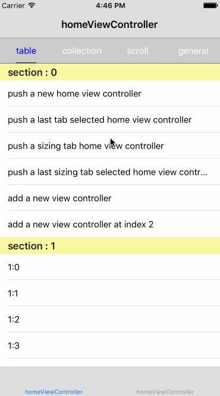

# SPSlideTabViewController

A TabBarController with top TabBar and slide content view.

## Screenshot for Demo



## Installation

#### Installation with CocoaPods

###### Podfile

To integrate SPSlideTabBarController into your Xcode project using CocoaPods, specify it in your `Podfile`:

```ruby
source 'https://github.com/CocoaPods/Specs.git'
platform :ios, '7.0'

pod 'SPSlideTabBarController', '~> 1.0.0'
```

Then, run the following command:

```bash
$ pod install
```

## Requirements

Minimum iOS Target: iOS 7.0

## Usage

1. SPSlideTabBarController

  - Initialize a SPSlideTabBarController

    ```objc
    TableViewController *tableViewController = [[TableViewController alloc] init];
    [tableViewController setTitle:@"table"];

    CollectionViewController *collectionViewController = [[CollectionViewController alloc] initWithCollectionViewLayout:[UICollectionViewFlowLayout new]];
    [collectionViewController setTitle:@"collection"];

    ScrollViewController *scrollViewController = [[ScrollViewController alloc] init];
    [scrollViewController setTitle:@"scroll"];

    ViewController *viewController = [[ViewController alloc] init];
    [viewController setTitle:@"general"];

    SPSlideTabBarController *slideTabBarController = [[SPSlideTabBarController alloc] initWithViewController:@[tableViewController, collectionViewController, scrollViewController, viewController] initTabIndex:2];
    ```

  - Selected a tab with a SPSlideTabBarController

    ```objc
    - (void)selectTabIndex:(NSUInteger)tabIndex animated:(BOOL)animated；
    ```

  - Add a UIViewController to a SPSlideTabBarController

    ```objc
    /**
     * add a viewController to the slideTabBarController
     *
     * 为当前的 slideTabBarController 增加一个 viewController
     *
     * @discussion the viewController and the tab bar item will be added at the last index by default.
     * @discussion 待加入的 viewController 和 tab bar item 会被默认加到最后一个
     */
    - (void)addViewController:(nonnull UIViewController *)viewController;

    /**
     * add a viewController to the slideTabBarController at the index
     *
     * 为当前的 slideTabBarController 增加一个 viewController，添加到 index 的位置
     */
    - (void)addViewController:(nonnull UIViewController *)viewController atIndex:(NSUInteger)tabIndex;
    ```

2. Custom a slide tab bar

  a easy way to define a custom slide tab bar is to define a view which follows the protocol `SPSlideTabBarProtocol`.

  There are two defined custom slide tab bar already.

  - `SPFixedSlideTabBar`

    ```objc
    /**
     * a custom slide tab bar whose tabs' width is fixed which is depend on the slide tab bar's width.
     *    
     * 一个定制的 slide tab bar. 所有 tab 都是固定宽度的，具体宽度是多少是根据 tab bar 的宽度来均分计算的。
     */
    @interface SPFixedSlideTabBar : UIView <SPSlideTabBarProtocol>
    @end
    ```

  - `SPSizingSlideTabBar`

    ```objc
    /**
     * a custom slide tab bar whose tabs' width is depend on the content size of the tab.
     *
     * 一个定制的 slide tab bar. 所有 tab 的宽度都是根据 tab 的内容来自适应的。
     */
    @interface SPSizingSlideTabBar : SPFixedSlideTabBar
    @end
    ```

3. Style slide tab bar item

  ```objc
  [[SPSlideTabBarItem appearance] setBarItemSelectedTextColor:[UIColor blueColor]];
  ```

## License

SPSlideTabBarController is released under the MIT license. See LICENSE for details.
